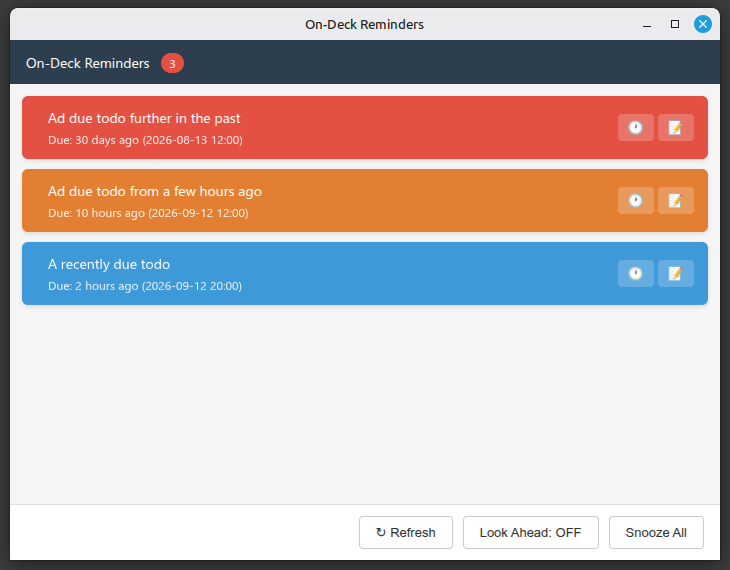
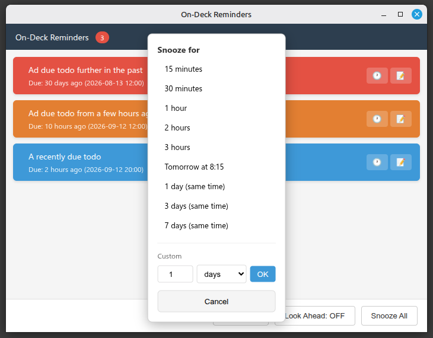
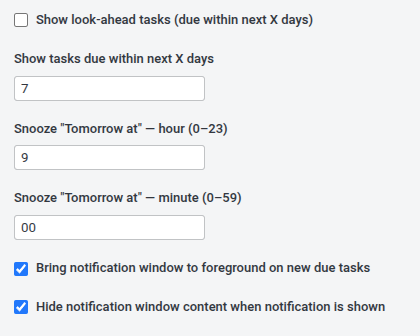

# On-Deck Reminders - Joplin Plugin

Shows a standalone window (desktop) or panel (mobile) with tasks that are due or overdue. Auto-opens when tasks need attention. Supports opening notes and snoozing tasks.

## Screenshots

Settings:

## Installation

**From the Joplin plugin store:** Search for "On Deck" in `Tools → Options → Plugins` and click **Install**.

## Usage

- **Desktop:** The window opens automatically when tasks are due or overdue and closes again when everything is clear. Click a task to open its note.
- **Snooze:** Push a task's due date into the future - presets or a custom number of days.
- **Mobile:** Toggle the panel with the **Toggle On-Deck Panel** command.
- **Optional Privacy:** When the window is opened by a notification, its content stays hidden until you press **Show tasks** (desktop).

## Settings

In Joplin settings under **On-Deck**:

- **Show look-ahead tasks** - also show tasks due within the next **X days** (default 7).
- **Snooze "Tomorrow at"** - the time used by the _tomorrow_ snooze option (default 09:00).
- **Bring notification window to foreground** (desktop) — focus the window when new due tasks appear.
- **Hide notification window content** (desktop) — keep task content hidden while a notification is shown (default off).
